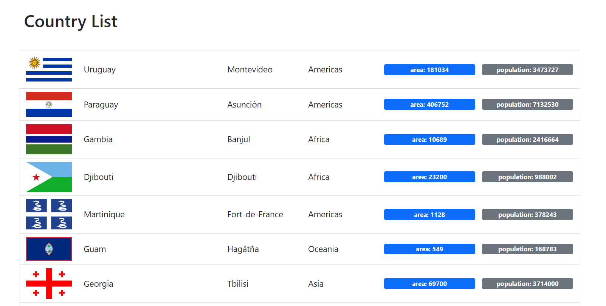

<h1 align="center">Country List</h1>


<!-- ABOUT THE PROJECT -->
## About The Project



### Built With

* [React](https://ru.reactjs.org/)
* [TypeScript](https://www.typescriptlang.org/)
* [Bootstrap](https://getbootstrap.com/docs/5.1/getting-started/introduction/)

### Installation

1. Clone the repo
   ```sh
   git clone git@github.com:OlgaUsovich/react-country-list.git
   ```
2. Install NPM packages
   ```sh
   npm install
   ```

<!-- USAGE EXAMPLES -->
## Usage

Simple layout on React. Use for stydy.


<!-- CONTACT -->
## Contact

Olga Usovich - [@linkedin](https://www.linkedin.com/in/volha-usovich-758119205) - olya.usovich.17@mail.ru

Project Link: [https://github.com/OlgaUsovich/react-country-list](https://github.com/OlgaUsovich/react-country-list)